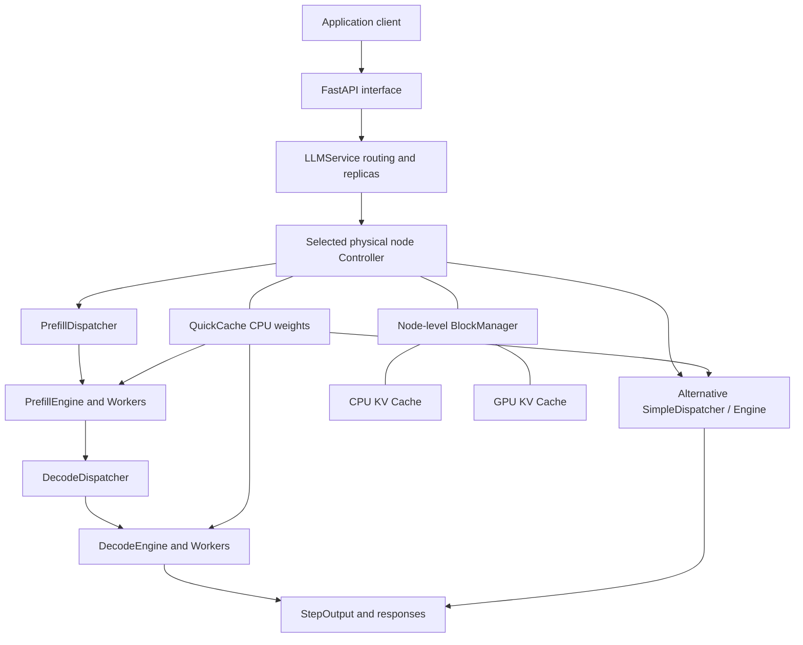

# System Architecture

## Execution relationships

Simple and P/D are mutually exclusive modes. The diagram shows alternative paths rather than both enabled in one NodeConfig.

## Control plane

The API handles schemas, tokenizers, chat templates, string stops, streaming deltas, access statistics, and model operations. LLMService manages Controllers, replica placement, request reservations, and model operations. Its least-outstanding routing compares each node's unfinished reservations across all models.

Each Controller is an asynchronous Ray actor maintaining Dispatchers, Schedulers, StageEngines, BlockManager, QuickCache, and events. asyncio schedules work while Workers execute GPU computation; the API process does not compute model forwards directly.

## Data plane

Workers load vLLM models, construct inputs and attention metadata, manage local tensors and CUDA streams/events, execute forwards, and generate tokens through argmax. StageEngine aggregates Worker results and calls the Controller back with each StepOutput.

Multiple models can be cached in CPU QuickCache. Workers switch active models at lifecycle boundaries. A CPU cache hit still needs device loading, KV/metadata initialization, and other preparation; model switching is not free.

## Two caches

QuickCache stores weights; BlockManager manages request KV state. Their purposes, budgets, and eviction rules differ. Sufficient weight capacity does not guarantee sufficient KV capacity, and available GPU memory does not guarantee available CPU slabs.

CUDA events coordinate KV transfers with streams, block availability, and completion of old-model KV transfers before switching. Direct GPU→GPU KV migration is not currently implemented; CPU is an explicit intermediate.

## Request flow

1. The API resolves model and parameters and encodes the prompt.
2. LLMService creates a reservation on a READY node.
3. The Controller hands the Request to the appropriate Dispatcher.
4. A Prefill or Simple Engine generates the first token.
5. Decode proceeds through rounds/quotas, switching models and transferring KV as needed.
6. The API emits content and usage; backend completion clears outputs and reservations.

Requests do not migrate across physical nodes. Work Stealing only changes ownership of eligible Decode batches within a node.

## Code entry points

| Layer | Main files |
|---|---|
| CLI / HTTP | cli.py, api.py |
| Control plane and cluster | llm.py |
| Engines / GPU execution | stage_engine.py, worker.py |
| Scheduling | simple/prefill/decode dispatchers and schedulers |
| Weight loading | loader/, quick_model_loader/ |
| KV management | block_manager.py, cache_groups.py, cache_transfer.py, vllm_cache.py, repository-root ops/ |
| Registration and budgets | config.py, model_registry.py, device_registry.py, estimator.py |
| Graph restoration | cuda_graph.py, graph_config.py, graph_bindings.py, foundry_runtime.py, foundry/ |

See the [source module index](source-reference.md) for the full list.
