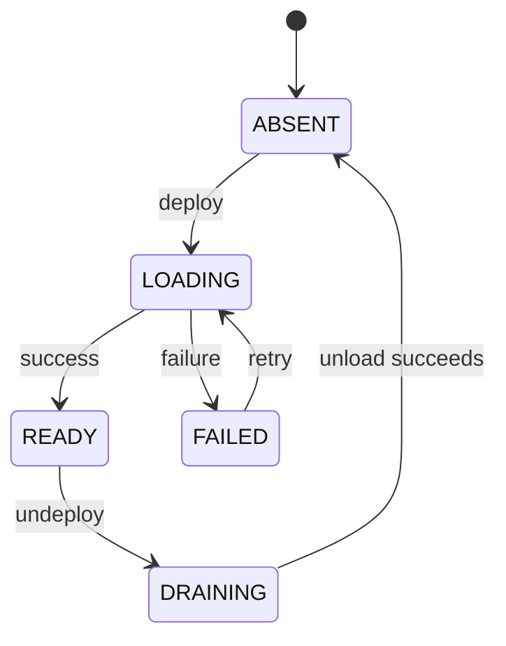

# Dynamic Deployment, Placement, and Unloading

## Cached replica states

A node replica means the QuickCache entry and service registration for `(model, physical Ray node)`, not a permanently GPU-resident weight copy on each engine.



The diagram shows the main lifecycle. Only READY replicas receive new requests. DRAINING replicas reject new requests and continue work that was already submitted.

## Automatic placement

least-loaded ranks nodes using cache layouts, evictable inactive models, estimated eviction costs, request loads, free cache, and cached-model counts. Node IDs break ties deterministically. This policy does not merely compare GPU utilization.

QuickCache fit considers allocator slices, so fragmentation affects placement. Load uses the maximum of Controller active count and API outstanding reservations as an estimate from asynchronous snapshots, avoiding double counting from direct addition; it is not the exact deduplicated union of the two request sets.

`replica_count` is a minimum target. Reducing it after reaching the target does not automatically remove excess replicas. Explicit `node_ids` bypass automatic selection. Placement runs on deploy calls rather than continuously autoscaling node counts.

```yaml
server:
  model_placement_policy: least-loaded
  request_routing_policy: least-outstanding
```

Both policies also support round-robin for comparisons. Unknown policy names fail startup.

## Request routing

least-outstanding selects from the model's READY nodes using each node's total API routing reservations across all models; equal loads rotate deterministically using the internal request ID. round-robin ignores load and selects by request ID modulo the READY node count.

One physical node owns the entire Prefill and Decode lifecycle of a request. Live requests do not migrate across physical nodes. Node-local Decode Work Stealing is a separate mechanism.

## Eviction and failures

When capacity is insufficient, the Controller evicts cached models with no submitted active requests. Successful nodes return their eviction list in `evicted`. If deployment on a node fails after eviction, that failure branch returns only the error and omits its earlier evictions. After a deployment failure, compare runtime `nodes[].model_cache` with `model_placements`; restart the service before deploying the required models when these disagree.

Multi-node deployment can partially succeed. Complete failure without an existing READY replica returns 507. LLMService serializes replica deployment and unloading per model. Replica operations for different models can proceed concurrently while sharing node caches; this lock does not cover all HTTP-layer registry metadata processing.

Unloading first marks a replica DRAINING. Active requests or API reservations produce a rejection result; run undeploy again after those requests finish. Before replacing model files, changing the path for an existing name, or updating archives, drain and unload the replica, then rerun the model acceptance procedure after deployment.

## Start an empty service

```yaml
server:
  startup_models: []
```

Empty startup still initializes Engines, CPU KV, and QuickCache. With model_cache_size_gb=0 and no startup models, the Controller creates a 20 GiB weight cache; later deployments do not grow it without limit. Foundry LOAD requires complete configured-model archives and differs from ordinary empty startup.

## Operational checks

```bash
curl -sS http://127.0.0.1:8000/v1/aegaeon/runtime
```

Inspect model_placements, last_model_placement_decision, model_placement_stats, request_routing, and node cache/request statistics. Model listing reflects API registration alone and does not guarantee routability on a node.

Implementation details are available in `docs/model-placement.md`.
