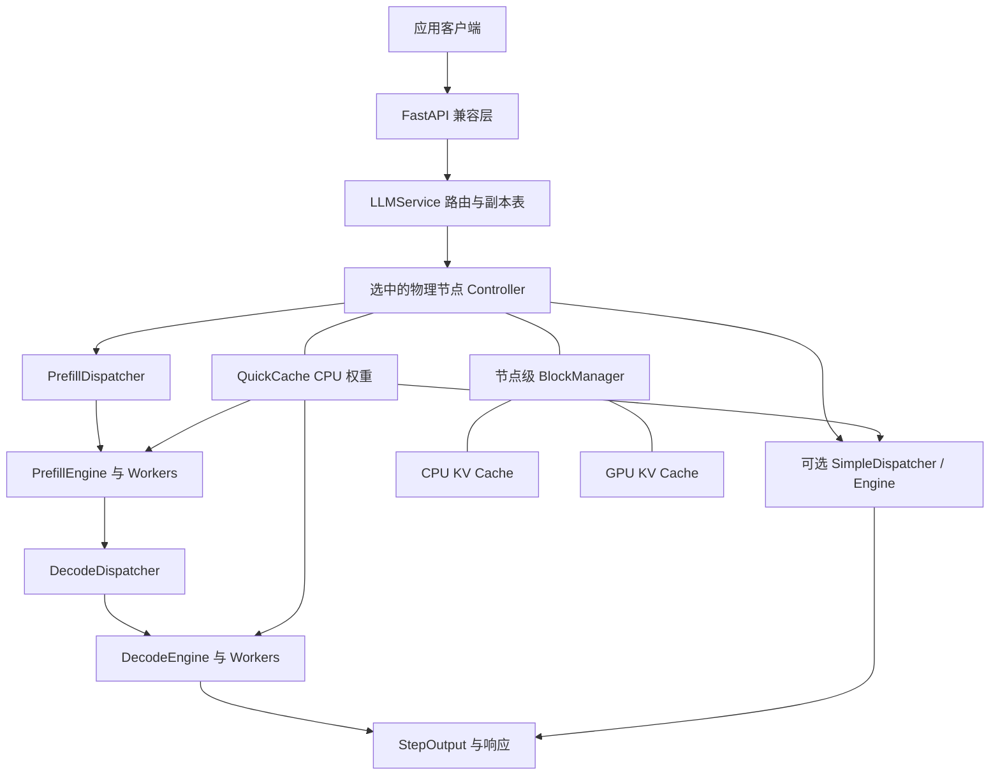

# 系统架构

## 执行关系

Simple 与 P/D 是两种互斥模式，图中并列展示两条可选路径；每个 NodeConfig 选择其中一种。

## 控制面

API 层处理 schema、tokenizer、chat template、停止文本、流式增量、访问统计与模型部署。LLMService 管理多个 Controller、副本放置、请求 reservation 和模型操作。

每个 Controller 是异步 Ray actor，维护 Dispatcher、Scheduler、StageEngine、BlockManager、QuickCache 和事件记录。asyncio 负责调度，Workers 负责 GPU 计算，API 进程负责 HTTP 与控制面。

## 数据面

Worker 加载 vLLM 模型、构造输入与 attention metadata、管理本地张量及 CUDA streams/events，执行前向并以 argmax 生成 token。StageEngine 汇聚 Worker 的结果并回调 Controller，产生每步 StepOutput。

多个模型权重可以缓存在 CPU QuickCache，Worker 在模型生命周期边界切换 active model。CPU 权重缓存命中会省去下载和 CPU 侧装载，同时仍包含设备加载、KV/metadata 初始化等准备工作。

## 两种缓存

QuickCache 保存权重；BlockManager 管理请求的 KV 状态。两者分别计算预算并执行各自的驱逐规则。容量规划需要同时覆盖模型缓存、GPU KV 和 CPU slab。

KV 换入换出以 CUDA events 串联相关 stream，确保数据准备、源与目标 block 可用，以及切换前旧模型 KV 搬运完成。当前迁移路径以 CPU 作为显式中转。

## 请求过程

1. API 解析模型与参数，编码 prompt。
2. LLMService 为 READY 节点建立 reservation。
3. Controller 接收 Request，按模式交给 Dispatcher。
4. Prefill 或 Simple Engine 生成第一个 token。
5. Decode 调度按轮次/配额继续执行，必要时切换模型、移动 KV。
6. API 输出内容与使用量；后端完成后清理输出与 reservation。

每个请求在选定的物理节点上完成整个生命周期。Work Stealing 只改变该节点内安全 Decode 批次的 owner。

## 代码入口

| 层 | 主要文件 |
|---|---|
| CLI / HTTP | cli.py、api.py |
| 控制面与集群 | llm.py |
| 引擎 / GPU 执行 | stage_engine.py、worker.py |
| 调度 | simple/prefill/decode dispatcher 与 scheduler |
| 权重加载 | loader/、quick_model_loader/ |
| KV 管理 | block_manager.py、cache_groups.py、cache_transfer.py、vllm_cache.py、ops/ |
| 注册与预算 | config.py、model_registry.py、device_registry.py、estimator.py |
| 图恢复 | cuda_graph.py、graph_config.py、graph_bindings.py、foundry_runtime.py、foundry/ |

文件完整索引见 [源码模块](source-reference.md)。
