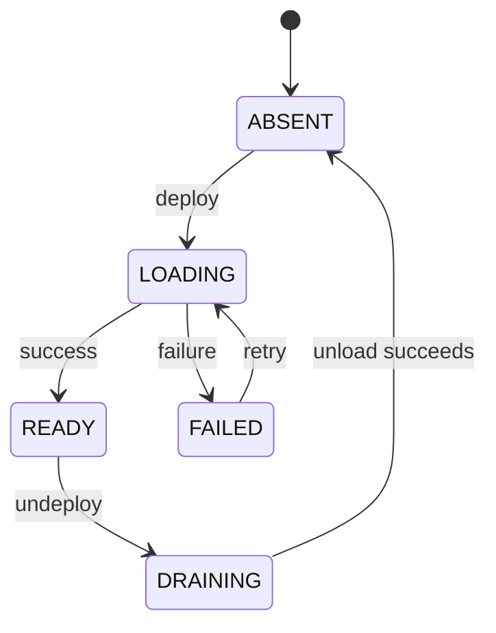

# 动态部署、放置与卸载

## 缓存副本状态

节点副本指 `(model, physical Ray node)` 的 QuickCache 缓存与服务登记；GPU 权重由各引擎按执行生命周期加载。



该图展示主要生命周期。只有 READY 副本参与新请求路由；DRAINING 副本拒绝新请求，并继续处理已经提交的工作。

## 自动放置

least-loaded 策略综合当前节点缓存布局、可驱逐非活动模型、驱逐估算成本、请求负载、空闲缓存和缓存模型数排名，最终用节点 ID 确定性打破平局。

QuickCache fit 使用 allocator 的 slice 布局，因此碎片也影响选择。负载取 Controller active count 与 API outstanding reservation 的最大值，既覆盖刚路由、尚在提交的请求，也避免对同一请求重复计数。

`replica_count` 是 deploy 的最小目标。缩容通过 undeploy 完成；再次传入更小的数值只会确认目标数量已经满足。显式 `node_ids` 会绕过自动选择。自动放置在 deploy 调用时运行，持续扩缩容需要由外部控制器发起。

```yaml
server:
  model_placement_policy: least-loaded
  request_routing_policy: least-outstanding
```

两个策略都可选择 round-robin 作为实验基线；未知策略名会导致启动失败。

## 请求路由

least-outstanding 选择该模型 READY 副本中未完成请求最少的节点；同负载按内部 request ID 确定性轮转。round-robin 忽略负载，按 request ID 对 READY 节点数取模。

一个请求的 Prefill 与 Decode 生命周期都由选定的物理节点承担。Decode Work Stealing 只在该节点内部调整安全批次的 owner。

## 驱逐与失败

部署遇到容量缺口时，会选择当前空闲且允许移除的缓存模型；实际驱逐项记录在响应的 `evicted` 和 runtime 中。

多节点部署允许部分成功；全部失败且无已有 READY 副本返回507。每模型的 deploy / undeploy 被串行化，不同模型的操作可以独立进行，但仍共享节点缓存。

卸载先将副本标记为 DRAINING。存在活动请求或 API reservation 时，响应会报告拒绝；请求结束后再次执行卸载。替换模型文件、修改同名模型 path 或更新存档前，应先排空并卸载副本，完成部署后重新执行模型验收步骤。

## 空服务启动

```yaml
server:
  startup_models: []
```

空服务也会初始化 Engine、CPU KV 和 QuickCache。model_cache_size_gb=0 且启动模型集合为空时，Controller 创建 20 GiB 权重缓存，后续动态部署沿用这项固定预算。Foundry LOAD 还要求为配置中的模型准备完整存档。

## 运维检查

```bash
curl -sS http://127.0.0.1:8000/v1/aegaeon/runtime
```

核对 model_placements、last_model_placement_decision、model_placement_stats、request_routing 和 nodes 的缓存/请求统计。模型列表用于确认 API 登记；节点可路由性以 READY 副本和 placement 状态为准。

模型放置的实现细节见仓库中的 `docs/model-placement.md`。
